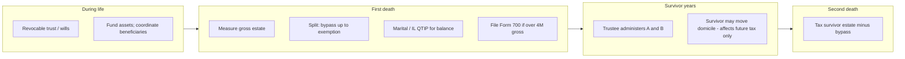

# Bypass trusts, first-death tax, and moving out of state

Date: 2026-05-18  
**Educational only — not legal or tax advice.** Confirm with an Illinois estate attorney and current law.

## Abstract

A **bypass trust** (credit shelter trust, **B trust**, family trust) holds the first spouse’s **estate tax exemption** at **first death** so those assets (and often their growth) are **not taxed again** in the survivor’s estate. Federally, **portability (DSUE)** can sometimes achieve a similar result without a bypass; **Illinois has no state portability**, so bypass-style planning matters for Illinois couples near or above the **$4M per-person** exemption.

**When tax is due:** Estate tax is measured at **each death**, with returns and payment on statutory deadlines (often with extensions). **Moving after someone dies** does not undo that person’s estate tax; the survivor’s later move may change **future** exposure only. **Moving before death** can change which state taxes apply only with a **bona fide domicile** change and attention to **asset situs**—not intent alone.

---

## 1. The problem bypass trusts solve

### 1.1 Two exemptions, two deaths

Married couples often think in terms of **one household**. Tax law thinks in terms of **two taxpayers**. Each spouse has:

- A **federal** estate tax exemption (much higher than Illinois, with **portability** of unused federal exemption to the survivor in many cases).
- An **Illinois** exemption of **$4,000,000 per person**, with **no portability**—unused Illinois exemption at first death is generally **lost** unless planning uses it.

If the first spouse leaves **everything outright to the survivor**:

- **Federal:** Often **no tax at first death** (unlimited marital deduction), and the survivor may later use **portability (DSUE)** for federal purposes.
- **Illinois:** Often **no tax at first death** (marital deduction), but the **first spouse’s $4M Illinois exemption may be wasted**. The survivor’s estate swells; at **second death**, Illinois tax can apply to a **much larger** Illinois taxable base.

A bypass trust is the classic way to **use the first spouse’s exemption at first death** while still supporting the survivor.

### 1.2 Names mean the same thing (usually)

| Term | Typical meaning |
|------|------------------|
| Bypass trust | Assets “bypass” the survivor’s taxable estate |
| Credit shelter trust | Shelters the estate tax credit/exemption amount |
| B trust | The “B” side of **A–B** planning (marital A + bypass B) |
| Family trust | Informal label in many plans |

Do not confuse this with a **revocable living trust** used for probate avoidance—that is often a **grantor trust** during life and **included** in the estate at death unless it becomes part of a different structure at death.

---

## 2. How A–B planning works at first death

### 2.1 The split

A typical **A–B** plan at **first death** divides assets between:

1. **Marital share (A trust / QTIP / outright marital bequest)** — for the survivor’s benefit; often qualifies for the **marital deduction** (federal and often state), deferring tax on that portion until **second death** (subject to elections and Illinois quirks).
2. **Bypass share (B trust)** — funded up to the **available exemption** (federal, Illinois, or the lesser of what the plan targets); structured so the **corpus is not included** in the survivor’s estate at **second death**.

The **document** (will and/or revocable trust with **disclaimer** or **formula** clauses) tells the fiduciary **how much** goes to each bucket. **Funding** (retitling, beneficiary designations, executor/trustee actions) must actually happen—paper alone is not enough.

### 2.2 What the bypass trust looks like in practice

Common features (plans vary):

- **Irrevocable** at first death (the dead spouse’s portion is no longer revocable).
- **Survivor’s rights:** Often **income for life**, sometimes **principal for health, education, maintenance, support (HEMS)** or limited invasions—**not** unlimited control (too much control can pull assets back into the survivor’s estate).
- **Other beneficiaries:** Children or heirs after the survivor’s death.
- **Trustee:** Survivor may be co-trustee; independent trustee sometimes used for tax/formality reasons.
- **Estate tax goal:** Amount allocated to the bypass at first death is designed to be **excluded** from the survivor’s gross estate at second death; **growth** inside the bypass also stays outside (a major long-term benefit).

### 2.3 Simple numeric intuition (Illinois)

Assume **Illinois resident**, **100% Illinois situs**, **no adjusted taxable gifts**, current law, and a plan that fully funds bypass with **$4M** at first death:

| Strategy | Rough first-death Illinois tax | Second-death issue |
|----------|-------------------------------|---------------------|
| All to survivor outright | Often **$0** | Survivor’s estate includes **everything**; only **one** $4M Illinois exemption left |
| **$4M to bypass**, rest to marital/QTIP | Uses **first** $4M exemption on bypass; marital share deferred | Second death taxes **only** what remains outside bypass (plus marital/QTIP assets) |

Exact dollars depend on **total estate**, **marital funding**, **Illinois QTIP elections**, and the **interrelated** Illinois calculation — see [illinois-estate-tax-computation](./illinois-estate-tax-computation.md) and [illinois-estate-tax-chart-3.9m-6m](./illinois-estate-tax-chart-3.9m-6m.md) ($3.8M–$10M).

---

## 3. Federal vs Illinois

| Topic | Federal | Illinois |
|-------|---------|----------|
| Exemption (order of magnitude) | Very large | **$4M** per person |
| Portability | **Yes** (DSUE) in many cases | **No** |
| Marital deduction | Unlimited (if qualified) | Generally yes, but **defers** rather than eliminates tax on marital share |
| Typical bypass role | Optional if portability + size suffice | **Critical** for many IL estates **$4M–$12M+** combined |

**Illinois-only QTIP** (35 ILCS 405/2(b-1)): A **state** election on Form 700, **independent** of federal QTIP, used when **federal exemption ≫ Illinois** so you do not over-fund bypass in a way that triggers unnecessary **Illinois** tax at first death while still preserving Illinois exemption. Coordination is often **bypass + marital/Illinois QTIP** in the right proportions — see [isba-illinois-qtip-bar-news](../documents/isba-illinois-qtip-bar-news.md) and [illinois-estate-tax-computation](./illinois-estate-tax-computation.md#married-couple-planning-pointer).

---

## 4. Implications

### 4.1 Tax

- **First death:** Bypass allocation **uses** exemption now; may reduce Illinois/federal tax at second death on bypass corpus and appreciation.
- **Income tax:** Bypass is usually **not** a grantor trust for the survivor (unlike a revocable living trust). Trust pays income tax under trust rules (compressed brackets) or distributes to beneficiaries with **K-1s**. **Step-up in basis** at first death applies to assets in the bypass to the extent they were includible in the decedent’s estate—important for highly appreciated assets.
- **Second death:** Assets remaining in bypass may get another step-up **only** for assets includible in the second decedent’s estate (often **not** the bypass corpus itself; marital/QTIP pieces differ). Tradeoff: estate tax savings vs income tax on sale later.
- **GST tax:** Large estates may need **generation-skipping** planning in bypass formulas.

### 4.2 Non-tax

- **Administration:** Separate EIN, trust accounting, annual tax returns, trustee duties.
- **Asset control:** Survivor may have **less** direct control over bypass assets than if everything were outright.
- **Creditors/divorce:** Trust terms may protect heirs better than outright marital property (depends on structure and state law).
- **Remarriage:** Bypass terms should address what happens if the survivor remarries (who benefits, who serves as trustee).
- **Fairness among children:** Bypass often benefits **lineal descendants**; marital share may differ—family politics matter.
- **Funding failures:** If IRAs, homes, or accounts never get allocated correctly, the plan **fails** in part—Illinois exemption wasted, probate fights, etc.

### 4.3 What bypass does **not** do

- Does **not** avoid tax on amounts **above** the funded exemption at first death (marital share is deferred, not erased).
- Does **not** replace **funding** the revocable trust or updating beneficiaries.
- Does **not** automatically help **income** tax during life (that’s a different trust type).
- Does **not** by itself fix **inheritance tax** in other states or **federal** tax if the estate is enormous—layered planning still required.

---

## 5. When is the estate taxed—first death or second?

### 5.1 Tax at each death

Estate tax is an **event tax** tied to a **transfer at death** (and some lifetime gifts). For a married couple:

| Event | What gets measured | Typical filing |
|-------|-------------------|----------------|
| **First spouse dies** | That spouse’s **gross estate** (worldwide for federal; Illinois rules for IL tax) minus deductions/credits | Federal **Form 706** if required; Illinois **Form 700** if gross estate **> $4M** |
| **Second spouse dies** | Survivor’s **own** gross estate—including assets they still own outright and often **marital/QTIP** assets, **excluding** properly structured bypass corpus | Same forms if thresholds met |

Bypass planning shifts **which pot** is taxed **when**, not whether tax exists forever.

### 5.2 “No tax at first death” can be misleading

**Outright to spouse** often produces **$0 Illinois tax at first death** because of the marital deduction—but that can mean **paying more later** when only one $4M Illinois exemption remains.

**Bypass at first death** may also show **$0 Illinois tax** if the bypass is fully sheltered by the **first** $4M exemption—even though assets moved into an irrevocable structure. The point is **preserving** exemption, not necessarily writing a check today.

### 5.3 Deadlines (conceptual)

- Returns and payment have **statutory due dates** (often **9 months after death**, with extensions commonly available for estate tax returns).
- **Do not** confuse “no tax due yet on marital share” with “no return required”—large estates may still need **Form 700** and elections (e.g. Illinois QTIP) even when tax due is low or zero.

Exact deadlines and extensions: current Illinois AG instructions and federal IRS rules for the year of death.

---

## 6. Moving out of state

### 6.1 After the first spouse dies

**The deceased’s estate tax is generally fixed by facts at their death:**

- **Domicile/residency** at death (for state estate tax).
- **Location/situs** of each asset (real estate, tangible property, business interests, etc.).
- For **Illinois residents**, the estate typically includes **worldwide** assets except certain **out-of-state real and tangible** property (35 ILCS 405/5 pattern—verify current statute).

**The survivor moving to Florida, Texas, etc. after the first death:**

- Does **not** re-open or erase the **first decedent’s** Illinois return if they were an Illinois resident at death with Illinois-situs property.
- May change **where the survivor pays income tax** and **what state taxes the survivor’s later estate** at **second death**.
- Does **not** remove assets already in a **funded bypass trust** from the planning architecture—that trust continues under its terms.

**Bottom line:** Post-death relocation is **not** a reliable fix for **first-death** Illinois estate tax that was already triggered by residency/situs and estate size.

### 6.2 Before death (planning window)

**Changing domicile before death** can change which state’s estate tax applies **for that person’s death**, but only if the change is **real**:

- **Domicile** = true home, with intent to remain—not a vacation home or a mailbox.
- States look at: time in state, home ownership, driver’s license, voter registration, doctors, family ties, where you file **resident** income tax returns, etc.
- **Illinois apportionment:** Even for some non-residents, **Illinois-situs** assets (e.g. Illinois real estate) can still attract **partial** Illinois estate tax via the situs fraction on Form 700.

**Survivor** who moves **before second death** might avoid **Illinois estate tax on the survivor’s worldwide estate** if they become a **bona fide non-resident** of Illinois—**but**:

- Illinois **real estate** and certain **tangible** property may still be taxed.
- **Federal** estate tax still applies if over federal threshold.
- **Income tax** on trust undistributed income continues.
- **Step-up and trust situs** issues remain.

### 6.3 Move assets vs move people

| Action | Effect |
|--------|--------|
| Retitle assets to non-IL LLC/trust without changing domicile | Often **does not** work; fraud/transfer concerns; situs rules |
| Sell Illinois real estate before death | Removes that asset from IL situs base (trade-offs: capital gains, lifestyle) |
| Establish bona fide domicile elsewhere **years before** death | May remove **resident** worldwide base for **that** decedent; planning must start early |
| Death-bed move | Usually **not** credible for domicile |

There is **no** general rule that heirs get a post-death period to “move the estate out of Illinois” before tax is computed. Tax is tied to **death** and **asset location/type**, not where beneficiaries live afterward.

### 6.4 Interaction with bypass at first death

If first death already funded a **$4M Illinois bypass**:

- Those assets are **outside** the survivor’s estate for **second-death** Illinois tax (if structure is correct).
- Survivor moving to a **no-estate-tax state** before **second death** may further reduce tax on **what the survivor still owns outright** and on **marital/QTIP** balances—but **not** magically recharacterize the **first** death or undo Illinois tax properly due on the **first** return.

---

## 7. Timeline (married couple, Illinois, illustrative)

---

## 8. Connection to the Illinois tax chart

The [illinois-estate-tax-chart-3.9m-6m](./illinois-estate-tax-chart-3.9m-6m.md) ($3.8M–$10M) shows **Illinois tax on one tentative estate** (100% IL situs, single death, no gifts). Married bypass planning is inherently **two-death**:

- **First death:** Tax depends on how much goes to **bypass** (exemption used) vs **marital** (deferred).
- **Second death:** Tax depends on survivor’s remaining estate **minus** bypass (and how QTIP/IL QTIP was elected).

Run the skill `~/.cursor/skills/illinois-estate-tax/scripts/il_estate_tax.py` **separately per death** with appropriate line 1 and QTIP inputs—not one combined “household” estate.

The **~28.6% marginal** band just above $4M on the chart is a quirk of the **current Illinois credit/cap formula** on a **single** estate curve—not a description of bypass itself.

---

## 9. Practical checklist (for counsel)

1. Combined net worth, split of assets, Illinois vs other situs?
2. Is **Illinois Form 700** required at **each** death (gross > $4M)?
3. Target bypass funding: **federal only**, **Illinois $4M**, or **both** (formula clause)?
4. Need **Illinois-only QTIP** on Form 700?
5. Are retirement accounts (tax-deferred) part of the plan—often **worst** assets to fund bypass without careful design?
6. Who is trustee, and what control does the survivor retain?
7. If considering **moving states**, how many years of facts support new domicile before each death?

---

## 10. Summary

A **bypass trust** implements the **first spouse’s estate tax exemption** at **first death** by holding assets outside the **survivor’s** taxable estate, which matters enormously in **Illinois** because **state exemption is not portable**. Tax is assessed **per death**, with returns due on legal deadlines—not optionally “settled later” by moving. **Moving after death** generally cannot unwind the deceased’s Illinois estate tax; **moving before death** may change **future** liability only with a **bona fide domicile change** and attention to **Illinois-situs** property left behind.

---

## Further reading

| Resource | Topic |
|----------|--------|
| [isba-married-tax-planning](../documents/isba-married-tax-planning.md) | Bypass trust; federal vs IL portability |
| [illinois-estate-tax-computation](./illinois-estate-tax-computation.md) | IL tax algorithm, iteration, situs, QTIP |
| [illinois-estate-tax-chart-3.9m-6m](./illinois-estate-tax-chart-3.9m-6m.md) | Single-death tax curve $3.8M–$10M |
| [hb2368](./hb2368.md) | Proposed 2026+ reform (not enacted) |
