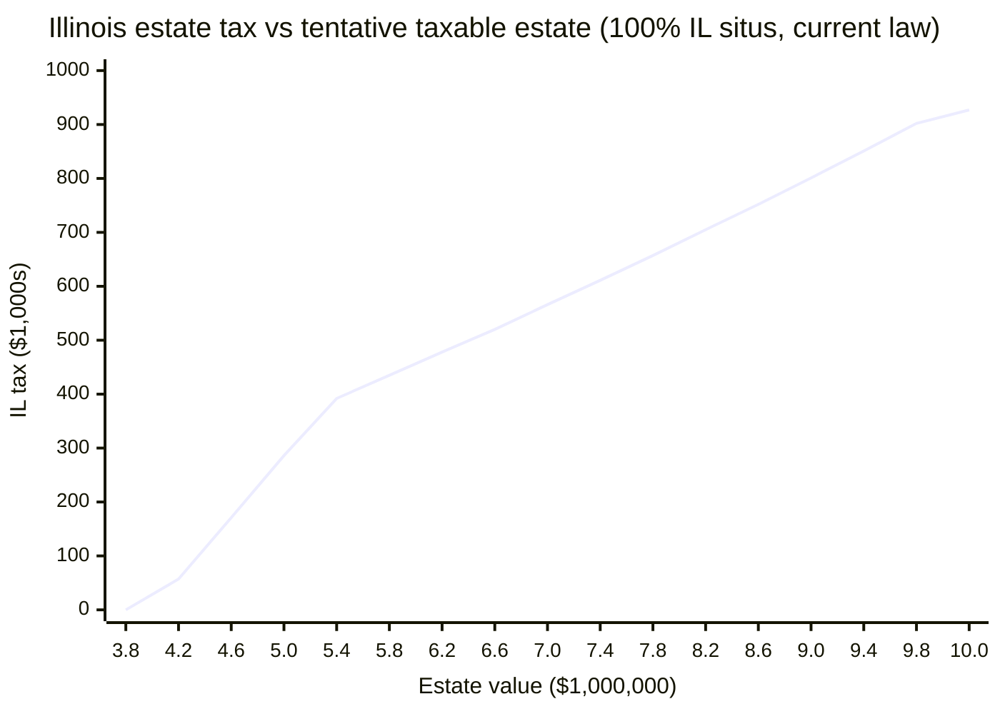

# Illinois estate tax vs. estate size ($3.8M–$10M)

Date: 2026-07-13  
**Educational only — not legal or tax advice.** Compare to [IL AG calculator](https://illinoisattorneygeneral.gov/estate-taxes/2013-2025-estate-calculator) and [illinois-estate-tax-computation](./illinois-estate-tax-computation.md).

## Assumptions

| Input | Value |
|-------|--------|
| Calculator | `~/.cursor/skills/illinois-estate-tax/scripts/il_estate_tax.py` |
| Mode | `current_law` (35 ILCS 405; IRC §2011 as of 12/31/2001 + **$4M** IL exclusion) |
| Form 700 line 1 | Tentative taxable estate (varies below) |
| QTIP (line 2) | $0 |
| Adjusted taxable gifts (line 4) | $0 |
| Illinois situs | **100%** (default; lines 7–9 not overridden) |
| Death date | `2026-01-01` (2013+ law metadata) |

Estate sizes: **$3,800,000** through **$10,000,000**, step **$400,000** (17 points; **$10,000,000** included as endpoint).

## Data

| Estate (line 1) | IL estate tax |
|-----------------|---------------|
| $3,800,000 | $0 |
| $4,200,000 | $57,143 |
| $4,600,000 | $171,428 |
| $5,000,000 | $285,714 |
| $5,400,000 | $392,446 |
| $5,800,000 | $434,643 |
| $6,200,000 | $477,500 |
| $6,600,000 | $520,357 |
| $7,000,000 | $565,603 |
| $7,400,000 | $610,993 |
| $7,800,000 | $656,690 |
| $8,200,000 | $704,577 |
| $8,600,000 | $752,465 |
| $9,000,000 | $801,049 |
| $9,400,000 | $851,399 |
| $9,800,000 | $901,748 |
| $10,000,000 | $926,923 |

## Chart

Tentative taxable estate on x-axis ($1,000,000); Illinois estate tax on y-axis ($1,000s).

%% Full series (estate → tax): 3800000→0, 4200000→57143, 4600000→171428, 5000000→285714, 5400000→392446, 5800000→434643, 6200000→477500, 6600000→520357, 7000000→565603, 7400000→610993, 7800000→656690, 8200000→704577, 8600000→752465, 9000000→801049, 9400000→851399, 9800000→901748, 10000000→926923

## Interpretation

- **No tax below $4M:** At **$3.8M** tentative taxable estate, Illinois tax is **$0** — consistent with the **$4,000,000** Illinois exclusion under current law.
- **Tax begins above $4M:** From **$4.2M**, tax is **~$57k** and rises in roughly **~$114k per $400k** of estate through **$5.0M** (~**6.9%** of the increment in that band), reflecting the legacy state death tax credit table plus interrelated iteration while the **federal 40% cap** binds.
- **Kink near $5.4M:** Growth **slows** after **$5.0M** ($5.0M→$5.4M adds **~$107k**, not ~$114k); from **$5.4M** onward the marginal step is **~$40–50k per $400k** (~**1%** effective on increments) when the federal cap no longer applies.
- **Upper range:** Tax continues to climb roughly linearly at that slower marginal rate; **$10M** endpoint is **$926,923** (~**9.3%** of $10M tentative estate in this scenario).

Related: [hb2368](./hb2368.md) (proposed flat-rate reform, not enacted).
