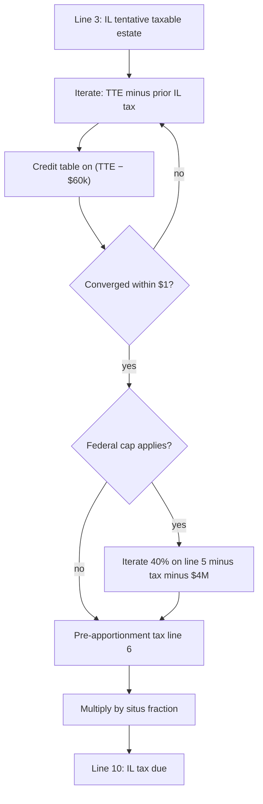

# Illinois estate tax computation (current law)

Date: 2026-05-18  
**Educational only — not legal or tax advice.** Use [Form 700](https://illinoisattorneygeneral.gov/publications/estatetax.html) and the [IL AG calculator](https://illinoisattorneygeneral.gov/estate-taxes/2013-2025-estate-calculator) for filing.

Agent skill: `~/.cursor/skills/illinois-estate-tax/` (`scripts/il_estate_tax.py`).

## Statutory basis

- **35 ILCS 405/3(c):** Illinois tax = **state tax credit** (§2) × (IL-situs gross ÷ worldwide gross).
- **35 ILCS 405/2:** Credit = IRC **§2011 as of 12/31/2001**, with **$4,000,000** exclusion (not federal portability).
- **Form 700** Schedule A/B maps inputs to calculator lines **3** and **5**; line **6** = full tax before apportionment; line **10** = apportioned tax.

Sources: [ilcs-405-estate-tax-act](../documents/ilcs-405-estate-tax-act.md), [il-form-700-extracted](../documents/il-form-700-extracted.txt), [ilag-estate-tax-instruction-factsheet](../documents/ilag-estate-tax-instruction-factsheet-extracted.txt).

## Step-by-step (current law)

1. **Line 1 — Tentative taxable estate:** Form 706 line 3a (or equivalent).
2. **Line 2 — Illinois QTIP:** Amount elected on this return, or add-back from first spouse’s IL QTIP on survivor’s death.
3. **Line 3 — Illinois tentative taxable estate:**
   - QTIP elected here: line 1 − line 2.
   - Prior IL QTIP add-back: line 1 + line 2.
   - Else: line 1.
4. **Line 4 — Adjusted taxable gifts:** Form 706 line 4.
5. **Line 5 — Credit base with gifts:** line 3 + line 4 (required by AG calculator).
6. **Pre-apportionment tax (line 6):** Interrelated calculation (below) on line 3, with federal cap keyed to line 5.
7. **Situs (lines 7–9):**  
   `fraction = line_7 ÷ line_8` (IL gross estate ÷ total gross estate, each including prior IL QTIP add-back).
8. **Line 10:** `line_6 × fraction`.

## Situs apportionment

Per **405/3(c)** and Form 700:

```
IL tax due = full_state_tax_credit × (illinois_gross_estate / total_gross_estate)
```

- **Resident:** Generally all property has IL situs except real/tangible physically in another state (Schedule D).
- **Non-resident:** Only IL-situs real and tangible.

## Interrelated iteration

Illinois estate tax is **deductible** on the Illinois return, which lowers the taxable estate used for the credit — fixed point:

```
tax[n+1] = credit_table( (line_3 − tax[n]) − $60,000 )
```

- **$60,000:** Table adjustment in AG `CalcHtm.js` (legacy §2011 adjusted taxable estate mechanics).
- **Credit table:** IRC §2011 (12/31/2001) brackets — [AG taxtable.htm](https://illinoisattorneygeneral.gov/application/estate-tax-calculator/taxtable.htm), cached in skill `assets/state-death-tax-credit-table.json`.
- Converges when `|tax[n+1] − tax[n]| < $1` (AG default).

### Federal cap pass

If `(line_5 − tax − $4,000,000) × 40% < tax`, AG recomputes:

```
tax[n+1] = (line_5 − tax[n] − $4,000,000) × 40%
```

Caps Illinois tax when the credit table would exceed the federal-style limit. Estates below ~$4M after iteration typically settle at **$0**.



## Married-couple planning (pointer)

Illinois has **no portability** — each spouse’s **$4M** must be used separately. Typical pattern: **bypass (B) trust** to shelter first death’s exemption + marital **A / Illinois QTIP** for deferral. See [isba-married-tax-planning](../documents/isba-married-tax-planning.md). This note does **not** model two-death simulations; run separate estimates per death.

**Illinois-only QTIP:** State election on Form 700 (box 3, Schedule C) independent of federal QTIP — reduces line 3 on first death; add-back on second.

## HB2368 contrast (not law)

[hb2368.md](./hb2368.md) — proposed deaths **on/after 1/1/2026**: replace credit table with **Illinois taxable estate × flat rate** (5% / 10% / 16% / 22% on **entire** base; cliffs at $6M / $16M / $21M). Skill flag: `mode: hb2368_hypothetical`.

## AG validation examples

| Tentative (line 3) | Gifts (line 4) | Situs | IL tax (approx) |
|--------------------|----------------|-------|-----------------|
| $2,000,000 | $0 | 100% | $0 |
| $4,000,000 | $0 | 100% | $0 |
| $5,000,000 | $0 | 100% | $285,714 |
| $3,000,100 | $1,000,000 | 100% | $28 |
| $5,000,000 | $0 | 50% | $142,857 |

From [ilag-estate-tax-instruction-factsheet](../documents/ilag-estate-tax-instruction-factsheet-extracted.txt).
