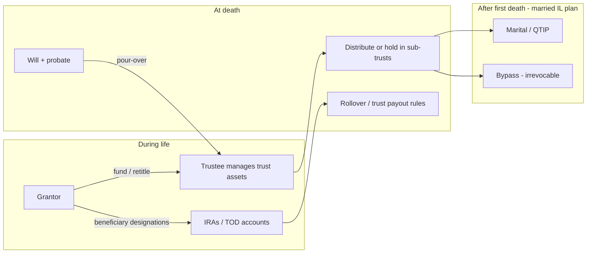

# Trusts for estates — overview

Educational overview of how trusts fit estate planning: what they do, how they run through life and death, funding (including retirement accounts), and tax layers. **Not legal or tax advice.** Illinois married-couple and bypass detail: [bypass-trust-and-first-death-tax](./bypass-trust-and-first-death-tax.md).

---

## 1. What a trust is

A **trust** is a legal arrangement: a **grantor** (settlor) transfers **trust property** to a **trustee**, who holds **legal title** and manages it for **beneficiaries** who hold **beneficial** interest, per the **trust instrument** (agreement or will article). [irs-estate-planning-basics](../documents/irs-estate-planning-basics.md) · [aba-estate-planning-glossary](../documents/aba-estate-planning-glossary.md)

Common purposes:

| Goal | Typical trust type |
|------|-------------------|
| Avoid probate / manage if incapacitated | **Revocable living trust** |
| Use both spouses’ estate tax exemptions (especially IL) | **Bypass / credit shelter** at first death |
| Defer estate tax on marital share | **QTIP** or outright marital bequest |
| Protect spendthrift heir, minor, or disabled beneficiary | **Irrevocable**, **spendthrift**, **special/supplemental needs** |
| Remove assets from estate / creditor exposure | **Irrevocable** (ILIT, SLAT, etc.) — tradeoffs |
| Charity + income | **Charitable remainder / lead** trust |

**Paper alone does nothing.** Only assets the trust **controls** (proper title, beneficiary designations, or death funding) follow the plan. [isba-living-trust-guide](../documents/isba-living-trust-guide.md)

---

## 2. Main trust categories

### 2.1 Revocable living (inter vivos) trust

- Created **during life**; grantor usually can **amend or revoke**.
- Synonyms: living trust, revocable trust, “loving trust.” [aba-revocable-trusts](../documents/aba-revocable-trusts.md)
- **Useful for:** probate avoidance (state-dependent), **privacy** (trust not filed like a will), **incapacity** (successor trustee manages trust assets without guardianship for those assets).
- **Does not** by itself reduce **federal or Illinois estate tax** — assets remain in the grantor’s estate while revocable. [aba-revocable-trusts](../documents/aba-revocable-trusts.md) · [learned-facts](./learned-facts.md)
- **Pour-over will** can send probate leftovers into the trust at death. [isba-living-trust-guide](../documents/isba-living-trust-guide.md)

### 2.2 Testamentary trust

- Created by **will** at death; estate usually **probates** first; trust funded from estate residue.
- Always **irrevocable** once funded (terms may allow amendment in limited cases).

### 2.3 Irrevocable trusts (lifetime)

- Grantor gives up (or limits) control; may move value out of taxable estate if structured correctly — **gift tax** on transfers, **income tax** rules depend on grantor-trust status.
- Examples: bypass/credit shelter **after** first death, **ILIT** (life insurance), **grantor retained annuity trust (GRAT)**, **intentionally defective grantor trust (IDGT)**, **Crummey** trusts for annual exclusion gifts, **dynasty** trusts in states that allow long perpetuities.

### 2.4 Marital / bypass (A–B) at death

At **first death** of a married couple, the plan often splits:

- **A (marital):** QTIP or outright to survivor — **marital deduction**, taxed at **second death** (with elections).
- **B (bypass):** Credit shelter — uses first decedent’s **exemption**, corpus **outside** survivor’s estate.

Illinois has **no state portability** of the $4M exemption — bypass-style funding matters for IL couples. Federal **portability (DSUE)** can sometimes reduce need for bypass federally, but not for IL. Detail: [bypass-trust-and-first-death-tax](./bypass-trust-and-first-death-tax.md) · [isba-married-tax-planning](../documents/isba-married-tax-planning.md)

### 2.5 Other specialized trusts

- **Special / supplemental needs:** preserve government benefits while supplementing care.
- **Spendthrift:** limit voluntary and involuntary transfers to beneficiaries.
- **Minor’s trust / UTMA alternative:** hold assets past age 18.
- **Charitable remainder / lead:** income to donor or charity, remainder to charity or heirs — separate income and estate tax rules.

---

## 3. How a plan “plays out” over time

| Phase | Revocable living trust | Bypass / QTIP (after first death) |
|-------|------------------------|-----------------------------------|
| **Life** | Grantor often trustee; amend anytime | N/A until funding event |
| **Incapacity** | Successor trustee steps in | Survivor may be trustee of B with restrictions |
| **First death** | May divide into sub-trusts per formula/disclaimer | B funded to exemption; A for marital share |
| **Second death** | Remaining trust assets distributed or held for heirs | B corpus **not** in survivor’s taxable estate; A/QTIP in estate |

**Failure modes:** unfunded trust; wrong beneficiary on IRA; stale deed; formula clause with no assets to fund B; funding bypass with **wrong asset types** (see §5). [bypass-trust-and-first-death-tax](./bypass-trust-and-first-death-tax.md)

---

## 4. Funding mechanics (non-retirement)

| Method | What moves |
|--------|------------|
| **Deed** | Real estate into trust name |
| **Assignment / retitle** | Brokerage, bank, LLC interests |
| **Beneficiary / TOD / POD** | Payable to trust or individuals at death |
| **Will / pour-over** | Probate assets to trust |
| **Disclaimer** | Surviving spouse refuses portion → flows to bypass per document |

Illinois small-estate affidavit (no real estate, under threshold — verify current amount) may avoid probate for modest estates without a trust. [isba-living-trust-guide](../documents/isba-living-trust-guide.md)

**Creditors:** trust does not magically shield assets from legitimate debts; trustee pays debts before distributions. Revocable trust assets remain reachable in many cases during grantor’s life.

---

## 5. Roth IRAs, IRAs, and trusts

Retirement accounts are **not** like a house or brokerage account. The **custodian contract** controls ownership; you generally **cannot “deed” a Roth into a trust** during life without a **taxable distribution** (Roth: usually tax-free principal if qualified, but loses stretch / complicates planning).

### 5.1 During life

| Action | Typical result |
|--------|----------------|
| Retitle Roth to “Trust X” at custodian | Often treated as **distribution** to you, then contribution to trust — avoid without counsel |
| Name **revocable living trust** as IRA beneficiary | Allowed at many custodians; must meet **see-through trust** rules for post-death payout |
| Name **irrevocable / bypass** as beneficiary while alive | Usually **poor idea** — compressed trust tax rates, lost spousal rollover, SECURE payout rules |

**Roth conversion** is an **individual** income-tax event; it does not “fund” a trust. Cash after conversion can be gifted to an irrevocable trust (gift tax may apply).

### 5.2 At death — beneficiary designation drives everything

- **Spouse beneficiary:** can often **roll over** to own IRA and keep Roth tax treatment (best default for many couples).
- **Non-spouse (including many trusts):** **SECURE Act** — most must empty account within **10 years** (no lifetime stretch); exceptions for **eligible designated beneficiaries** (surviving spouse, disabled, chronically ill, minor child until majority, ≤10 years younger beneficiary).
- **Trust as beneficiary:** trust must qualify as a **see-through** trust (e.g. **conduit** — RMDs paid out to beneficiaries quickly; or **accumulation** — different 10-year / RMD mechanics). Drafting errors → trust taxed as if no designated beneficiary (worse outcomes).

### 5.3 Funding bypass / credit shelter with Roth — caution

Bypass trusts are usually funded with **estate-includable** assets that received a **basis step-up** at first death. **Roth** is already tax-free on qualified distributions; putting Roth into a **bypass** via beneficiary designation:

- Does not add much income-tax benefit inside the trust.
- Triggers **trust income tax** on any **non-Roth** income retained in trust (compressed brackets).
- Complicates **payout timing** for heirs vs naming individuals or spousal rollover.

Estate planners often prefer: **taxable brokerage / real estate** to fund bypass; **Roth to spouse or children** directly (or to a **separate see-through trust** drafted only for retirement benefits). [bypass-trust-and-first-death-tax](./bypass-trust-and-first-death-tax.md) (checklist item 5)

### 5.4 Practical default (conceptual)

1. **Spouse** — primary beneficiary of Roth/IRA when appropriate.
2. **See-through trust** — only when control, minor, or spendthrift goals require it; coordinate with estate attorney.
3. **Bypass / B trust** — fund with **non-qualified** step-up assets; align formulas and beneficiary designations in one coordinated document set.

---

## 6. Taxation — three layers

### 6.1 Income tax (while trust exists)

| Status | Who reports income | Return |
|--------|-------------------|--------|
| **Grantor trust** (all revocable; some irrevocable) | **Grantor** on Form 1040 | Trust disregarded; no 1041 usually |
| **Non-grantor irrevocable** | Trust or beneficiaries via **DNI** / K-1 | Form **1041**; trust hits **compressed** brackets quickly |
| **Bypass after first death** | Usually **non-grantor** | 1041; distributions may carry out income to beneficiaries |

[irs-grantor-trust-qa](../documents/irs-grantor-trust-qa.md)

### 6.2 Gift tax (lifetime transfers)

- Transfers to **revocable** trust: generally **not** taxable gifts (still your assets).
- Transfers to **irrevocable** trust: often **taxable gifts**; use annual exclusion, lifetime exemption; file **Form 709** when required.

### 6.3 Estate tax (death)

- **Revocable trust assets:** **included** in grantor’s gross estate (federal and Illinois).
- **Bypass corpus at second death:** **excluded** from survivor’s estate if properly structured and funded.
- **QTIP / marital:** included at second death; marital deduction at first death.
- **Illinois:** $4M per person exemption; **no portability**; Form **700** when gross estate over threshold. [illinois-estate-tax-computation](./illinois-estate-tax-computation.md) · [nolo-illinois-estate-tax](../documents/nolo-illinois-estate-tax.md)

Federal exemption (2026+): confirm current law — TCJA sunset and legislative changes affect whether bypass is needed **federally**; Illinois planning may still need bypass for state tax.

### 6.4 Generation-skipping transfer (GST)

Dynasty / grandchildren-skipping transfers may trigger **GST tax** if allocations are not made; separate from basic estate tax.

---

## 7. Revocable trust vs will — when each matters

| | Will only | Revocable trust + pour-over will |
|--|-----------|----------------------------------|
| Probate | Usually yes (except small estate) | Avoided for **funded** trust assets |
| Public record | Will filed in IL | Trust instrument typically private |
| Incapacity | Needs power of attorney for assets outside trust | Trustee manages trust assets |
| Cost | Lower upfront | Higher setup + funding discipline |

Living trusts are **oversold** in seminars; value depends on **state probate cost**, **real estate**, **privacy**, and **incapacity** needs. [ftc-living-trust-consumer-guide](../documents/ftc-living-trust-consumer-guide.pdf) · [aba-revocable-trusts](../documents/aba-revocable-trusts.md)

---

## 8. Illinois-specific reminders

- Revocable living trust assets count toward **Illinois** taxable estate. [nolo-illinois-estate-tax](../documents/nolo-illinois-estate-tax.md)
- Married couples near **$4M each** should coordinate **bypass + Illinois QTIP** elections on Form 700 — not only federal Form 706. [isba-illinois-qtip-bar-news](../documents/isba-illinois-qtip-bar-news.md)
- **HB2368** (proposed reform) — not law as of notebook update; see [hb2368](./hb2368.md).

---

## 9. Questions for counsel

1. Probate vs trust — worth it for **your** asset mix and county?
2. Federal + **Illinois** exemption use — bypass, disclaimer, or portability-only federally?
3. **Asset map:** which accounts fund A vs B vs outright vs spouse rollover?
4. **Roth/IRA beneficiary lines** — match trust formulas; see-through language present?
5. Successor trustee, incapacity, remarriage, and **spendthrift** needs for heirs?
6. **Situs / domicile** if relocation possible — [bypass-trust-and-first-death-tax](./bypass-trust-and-first-death-tax.md)

---

## 10. Related notes & sources

| Note / source | Topic |
|---------------|--------|
| [bypass-trust-and-first-death-tax](./bypass-trust-and-first-death-tax.md) | A–B, first death, IL tax, moving states |
| [learned-facts](./learned-facts.md) | Cited one-liners |
| [aba-revocable-trusts](../documents/aba-revocable-trusts.md) | Living trusts |
| [irs-grantor-trust-qa](../documents/irs-grantor-trust-qa.md) | Grantor trust income tax |
| [isba-living-trust-guide](../documents/isba-living-trust-guide.md) | IL consumer guide |
| [isba-married-tax-planning](../documents/isba-married-tax-planning.md) | Married exemption planning |

*Notebook note created 2026-05-18. SECURE/SECURE 2.0 retirement payout rules change frequently — confirm with estate attorney and current IRS guidance for beneficiary trusts.*
